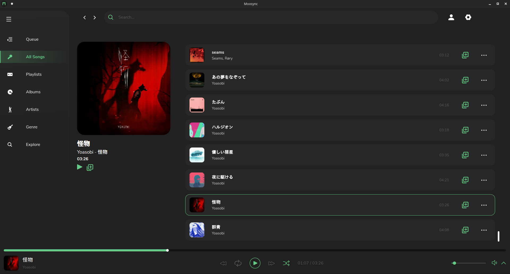
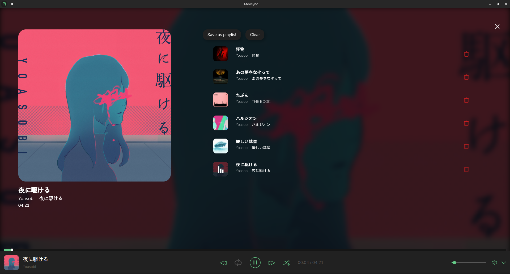

# Moosync

[](#contributors-)  [](https://discord.gg/HsbqbRune3) [](https://crowdin.com/project/moosync)

<p align="center"><b>Help up translate the project at <a href="https://crwd.in/moosync">Crowdin</a></b></p>

<br/>

#### Moosync is a customizable desktop music player with a clean interface

## Features

- Play audio files on your desktop.
- Seamlessly integrate your Spotify and Youtube songs.
- Lyrics fetch support
- Scrobble your tracks on LastFM.
- Get music recommendations directly from Spotify, Youtube and LastFM
- Mix and match songs from different providers in a single playlist
- Easy to use interface
- Customizable theme engine
- Develop own apps on top of Moosync Extension API
- Available on Windows and Linux and MacOS

## Links

[Official website](https://moosync.app) |
[Downloads](#releases) |
[Discord](https://discord.gg/HsbqbRune3)
[Crowdin](https://crwd.in/moosync)

## Releases

You may download the latest release from [Official website](https://moosync.app) or from [GitHub Releases](https://github.com/Moosync/moosync-tauri/releases)

### Package managers

#### Windows
```powershell
# Chocolatey
choco install moosync

# Scoop
scoop bucket add extras
scoop install moosync

# Winget
winget install Moosync.Moosync
```

#### Linux
```bash
# Flatpak (Universal)
flatpak install flathub app.moosync.moosync

# Snap (Universal)
sudo snap install moosync

# Arch Linux (AUR)
yay -S moosync

# Debian/Ubuntu (PPA)
curl -fsSL https://repo.moosync.app/gpg | sudo gpg --dearmor -o /usr/share/keyrings/moosync-archive-keyring.gpg
echo "deb [signed-by=/usr/share/keyrings/moosync-archive-keyring.gpg] https://repo.moosync.app/deb stable main" | sudo tee /etc/apt/sources.list.d/moosync.list
sudo apt update && sudo apt install moosync

# Fedora/CentOS/RHEL (DNF)
sudo dnf copr enable moosync/moosync
sudo dnf install moosync

# openSUSE (OBS)
sudo zypper addrepo https://download.opensuse.org/repositories/multimedia:/apps/openSUSE_Tumbleweed/ moosync
sudo zypper refresh && sudo zypper install moosync
```

#### macOS
```bash
# Homebrew
brew install --cask moosync

# MacPorts
sudo port install moosync

# Direct download
# Available from moosync.app/download
```

## Any questions?

Checkout the [Official Wiki](https://moosync.app/wiki/) on [moosync.app](https://moosync.app/wiki/) or on [GitHub](https://github.com/Moosync/Moosync/wiki).

For any further questions you may join us on [Discord](https://discord.gg/HsbqbRune3)

## Screenshots

### Main Interface
<p align="center">
  
  <br/>
  <em>Clean and intuitive song library interface</em>
</p>

### Music Info View
<p align="center">
  
  <br/>
  <em>Detailed track information with lyrics and recommendations</em>
</p>

### Key Features Showcase

#### 🎵 **Multi-Provider Integration**
- Seamlessly mix songs from Spotify, YouTube, and local files
- Unified search across all your music sources
- Smart playlist creation with songs from different providers

#### 🎨 **Customizable Themes**
- Dark and light theme variants
- Custom CSS theme engine
- Community-created themes available
- Real-time theme switching

#### 🔌 **Extension System**
- Rich extension API for developers
- Community extensions for enhanced functionality
- Easy extension installation and management

#### 📱 **Cross-Platform**
- Native desktop experience on Windows, macOS, and Linux
- Consistent UI across all platforms
- Platform-specific optimizations

#### 🎯 **Smart Features**
- Intelligent music recommendations
- Automatic lyrics fetching
- LastFM scrobbling support
- Queue management and smart shuffling

## Building from source

### Prerequisites

#### System Requirements
- **Operating System**: Windows 10+, macOS 10.15+, or Linux (Ubuntu 18.04+/equivalent)
- **Memory**: 4GB RAM minimum, 8GB recommended
- **Storage**: 2GB free space for development environment

#### Required Dependencies
```bash
# Rust toolchain (1.70+ required)
curl --proto '=https' --tlsv1.2 -sSf https://sh.rustup.rs | sh
source ~/.cargo/env

# Node.js and npm (for web dependencies)
# Install via your system package manager or from nodejs.org

# Platform-specific dependencies:

# Linux (Ubuntu/Debian)
sudo apt update
sudo apt install build-essential pkg-config libssl-dev libgtk-3-dev libwebkit2gtk-4.0-dev librsvg2-dev

# Linux (Fedora/CentOS)
sudo dnf groupinstall "Development Tools"
sudo dnf install pkg-config openssl-devel gtk3-devel webkit2gtk3-devel librsvg2-devel

# macOS (requires Xcode Command Line Tools)
xcode-select --install

# Windows (requires Visual Studio Build Tools)
# Download and install Visual Studio Build Tools 2019 or later
```

### Build Instructions

#### 1. Clone the Repository
```bash
git clone https://github.com/Moosync/moosync-tauri.git
cd moosync-tauri
```

#### 2. Install Dependencies
```bash
# Install Rust dependencies
cargo fetch

# Install trunk for frontend building
cargo install trunk

# Install additional tools
cargo install tauri-cli
```

#### 3. Development Build
```bash
# Start development server with hot reload
cargo tauri dev

# Or use the provided npm scripts
npm run tauri:dev
```

#### 4. Production Build
```bash
# Build optimized release version
cargo tauri build

# The built application will be in:
# - Windows: src-tauri/target/release/bundle/msi/
# - macOS: src-tauri/target/release/bundle/dmg/
# - Linux: src-tauri/target/release/bundle/deb/ (or rpm/appimage)
```

### Build Configuration

#### Environment Variables
```bash
# Optional: Enable debug features
export RUST_LOG=debug

# Optional: Custom build flags
export RUSTFLAGS="--cfg getrandom_backend=\"wasm_js\""

# Optional: Custom install directory
export DESTDIR="/custom/install/path"
```

#### Custom Features
```bash
# Build with specific features
cargo tauri build --features "mock,development"

# Build for specific target
cargo tauri build --target x86_64-pc-windows-msvc
```

### Development Workflow

#### Running Tests
```bash
# Run Rust tests
cargo test

# Run with coverage
cargo tarpaulin --out html --output-dir coverage/

# Run frontend tests
npm test
```

#### Code Quality
```bash
# Format code
cargo fmt
npm run format

# Run linting
cargo clippy -- -D warnings
npm run lint

# Check for security vulnerabilities
cargo audit
npm audit
```

#### Database Migrations
```bash
# Run database migrations (if needed)
cargo run --bin migrate

# Reset database (development only)
cargo run --bin reset-db
```

### Troubleshooting

#### Common Build Issues

**Problem**: `error: linker 'cc' not found`
```bash
# Solution: Install build tools
# Ubuntu/Debian: sudo apt install build-essential
# Fedora: sudo dnf groupinstall "Development Tools"
# macOS: xcode-select --install
```

**Problem**: `webkit2gtk not found`
```bash
# Solution: Install WebKit development libraries
sudo apt install libwebkit2gtk-4.0-dev  # Ubuntu/Debian
sudo dnf install webkit2gtk3-devel      # Fedora
```

**Problem**: `failed to run custom build command for openssl-sys`
```bash
# Solution: Install OpenSSL development libraries
sudo apt install libssl-dev pkg-config  # Ubuntu/Debian
sudo dnf install openssl-devel          # Fedora
brew install openssl                     # macOS
```

**Problem**: Out of memory during compilation
```bash
# Solution: Reduce parallel compilation
export CARGO_BUILD_JOBS=2
cargo tauri build
```

#### Performance Optimization
```bash
# Enable link-time optimization
export RUSTFLAGS="-C lto=fat"

# Use faster linker (Linux)
sudo apt install lld
export RUSTFLAGS="-C link-arg=-fuse-ld=lld"

# Use faster linker (macOS)
export RUSTFLAGS="-C link-arg=-fuse-ld=/usr/bin/ld"
```

### Contributing to Development

1. **Fork the repository** on GitHub
2. **Create a feature branch**: `git checkout -b feature/amazing-feature`
3. **Make your changes** following the coding standards
4. **Run tests**: `cargo test && npm test`
5. **Commit your changes**: `git commit -m "Add amazing feature"`
6. **Push to your fork**: `git push origin feature/amazing-feature`
7. **Create a Pull Request** on GitHub

#### Development Setup
```bash
# Install pre-commit hooks
pip install pre-commit
pre-commit install

# Set up IDE (VS Code recommended)
code --install-extension rust-lang.rust-analyzer
code --install-extension tauri-apps.tauri-vscode
```

For more detailed development documentation, see [CONTRIBUTING.md](CONTRIBUTING.md).

## Contributors ✨

Thanks goes to these wonderful people ([emoji key](https://allcontributors.org/docs/en/emoji-key)):

<!-- ALL-CONTRIBUTORS-LIST:START - Do not remove or modify this section -->
<!-- prettier-ignore-start -->
<!-- markdownlint-disable -->
<table>
  <tr>
    <td align="center"><a href="https://github.com/Mercyssh"><br /><sub><b>Ohm</b></sub></a><br /><a href="#design-Mercyssh" title="Design">🎨</a></td>
    <td align="center"><a href="http://androbuddy.github.io/studio-wingress"><br /><sub><b>Anirudh</b></sub></a><br /><a href="#design-AndroBuddy" title="Design">🎨</a></td>
    <td align="center"><a href="https://github.com/Ovenoboyo"><br /><sub><b>Sahil Gupte</b></sub></a><br /><a href="https://github.com/Moosync/Moosync/commits?author=Ovenoboyo" title="Code">💻</a></td>
  </tr>
</table>

<!-- markdownlint-restore -->
<!-- prettier-ignore-end -->

<!-- ALL-CONTRIBUTORS-LIST:END -->

This project follows the [all-contributors](https://github.com/all-contributors/all-contributors) specification. Contributions of any kind welcome!

## Donations

| Cryptocurrency | Address |
| --- | --- |
| Bitcoin (BTC) | bc1qhcywctcy4exkcdd726d2lxkwaluqwgym0ynf9j |
| Ethereum (ETH)| 0x0AFaCe6031e2fBe54D2fBF493310C0f5C3Cef677 |
| Dogecoin (DOGE) | bc1qhcywctcy4exkcdd726d2lxkwaluqwgym0ynf9j |
| Litecoin (LTC) | LLkim24N5yduBbXiFaLMbUeUwmyZ9VUQt7 |
| Polygon (MATIC) | 0x0AFaCe6031e2fBe54D2fBF493310C0f5C3Cef677 |
| Tether USD (USDT) | 0x0AFaCe6031e2fBe54D2fBF493310C0f5C3Cef677 |
| USD coin (USDC) | 0x0AFaCe6031e2fBe54D2fBF493310C0f5C3Cef677 |

## TODO
- Optimize cloning in leptos
- Optimize DB queries
- clear thumbnails on song removal  
- remove songs on path removal
- hide everything technical
- settings is 3/4th of the width
- song paths have alternating light-dark colors
- song paths icons should be everywhere
- multi-select tooltip on selecting one song on cursor (first n times)
- change add to queue icon
- Show a not logged in prompt in search (opens up spotify login flow)
- ^ do this everywhere theres a spotify tab
- Show accounts icon on right-most
- artists as circle
- overhaul search artists
- If loading takes more than n-secs (show popup)
- change sort icon (filter icon)
- add ascending/descending under filter
- Disable support for user installed extensions
- Titles to releases / more details
- Plugin repos for extensions

### Completed ✅
- ~~Preferences: Clear queue before adding playlist~~ ✅
- ~~System theme fetch~~ ✅  
- ~~show lyrics button~~ ✅ (already existed)
- ~~Rename handleCustomRequest to handleStreamRequest or something sensible~~ ✅
- ~~Support headers in custom requests~~ ✅
